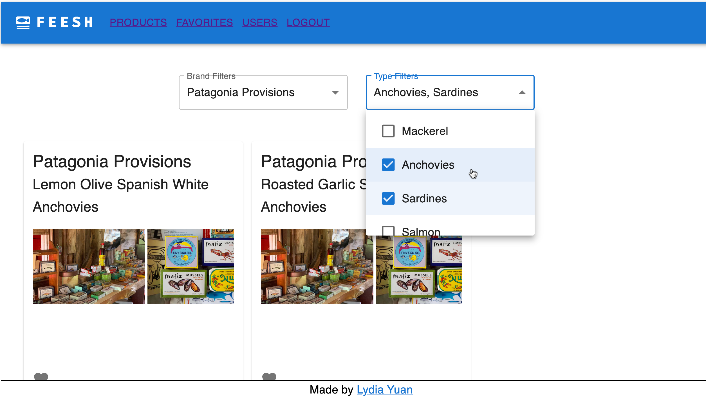
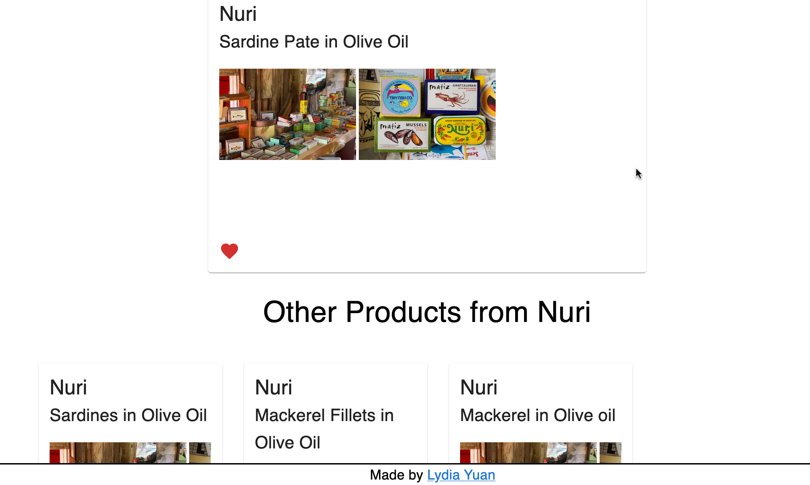
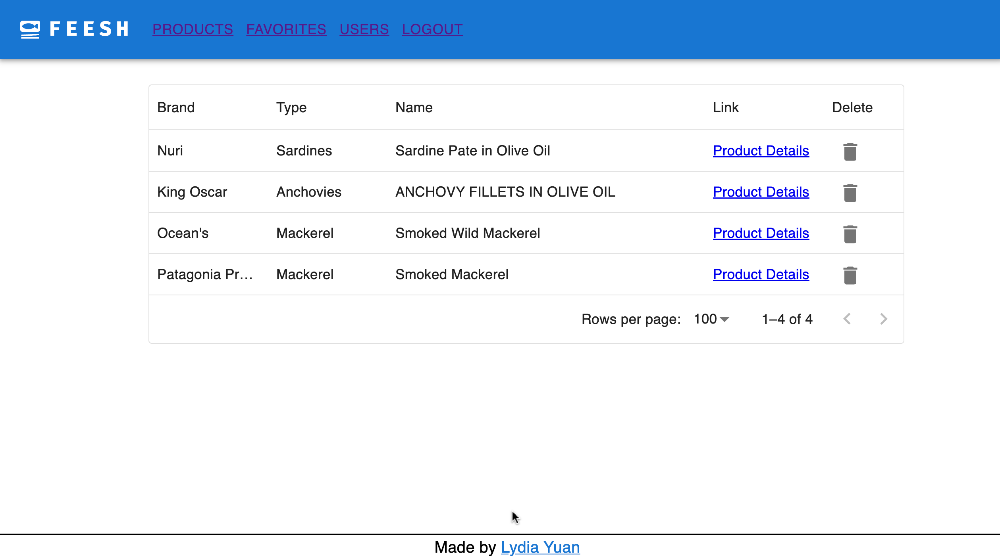
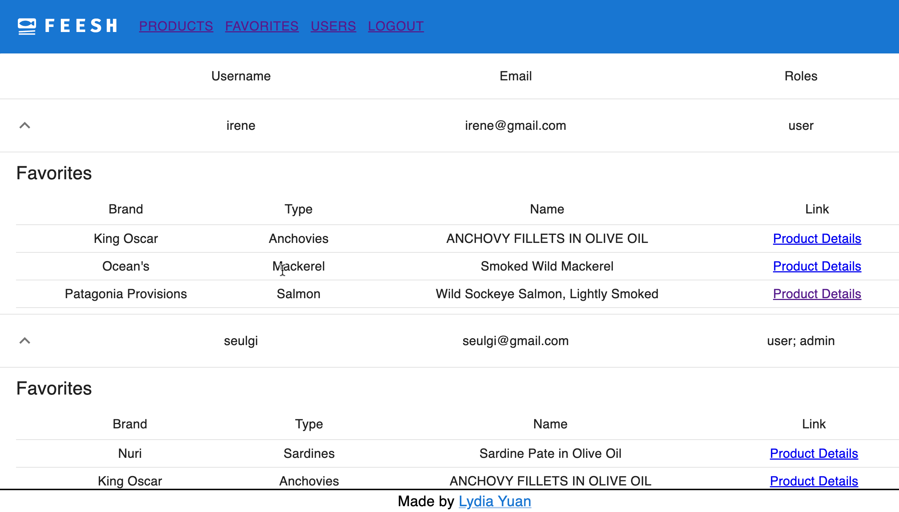

# FEESH: MERN + AWS Tinned Fish E-Commerce Demo

## Frontend
- React SPA
- Redux
- React Router

## Backend
- Node.js
- Express
- MongoDB

## Deployment
- AWS EC2 (Ubuntu) hosting for backend
- AWS S3 for image storage & frontend hosting

## Try it out!
- [Live Demo](http://feesh-react-frontend.s3-website.us-east-2.amazonaws.com/)

### Testing Accounts
#### Admin
- Email: seulgi@gmail.com
- Password: Password@123

#### User
- Email: irene@gmail.com
- Password: Password@123

## Features

### Browsing Products (Brand & Category Filters, Add to Favorites, ...)

### Product Details (Products from the Same Brand, ...)

### Favorites (Manage Favorites, ...)

### Admin Dashboard (User List & Their Favorites, ...)

